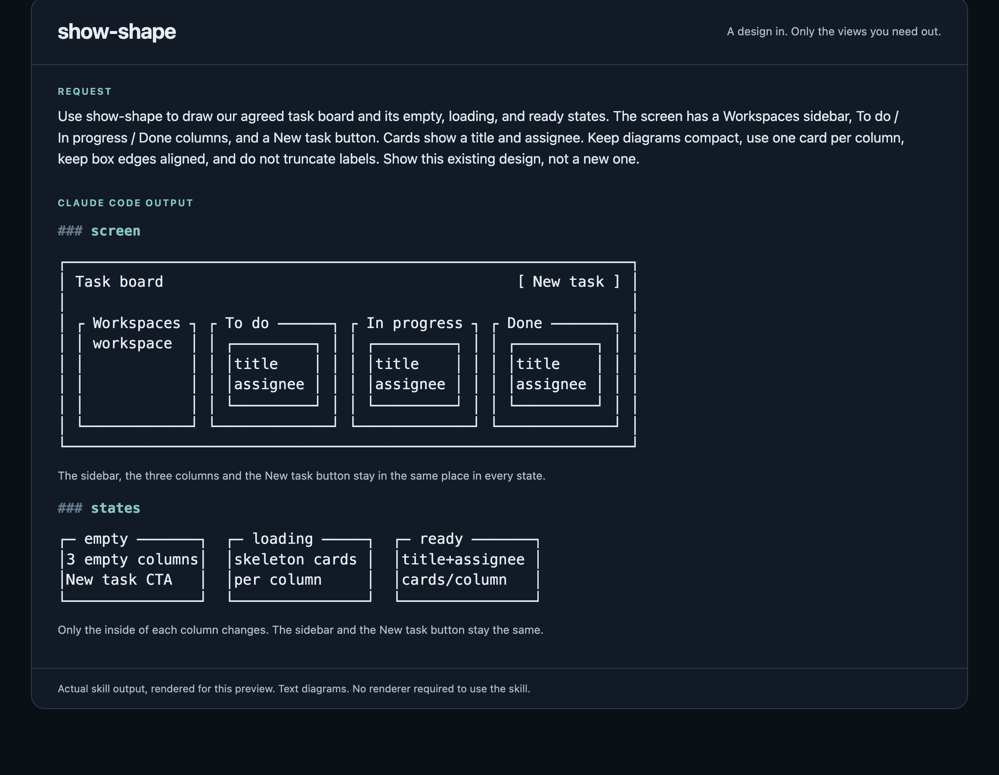

# show-shape

**Turn a design already under discussion into clear, focused diagrams.**

`show-shape` is a portable agent skill that draws the spatial layout, ownership,
and flow of an architecture or feature using text-based box diagrams. It selects
only the views that answer your question, rather than producing every diagram
for every request.

It visualizes the design on the table. It does **not** plan the feature, choose
an architecture, or implement it.

## In action



## Install

1. **With the [Skills CLI](https://github.com/vercel-labs/skills):**

   ```sh
   npx skills add superuserkalo/show-shape --skill show-shape
   ```

2. **Copy the complete skill directory into your agent's skill root:**

   ```sh
   git clone https://github.com/superuserkalo/show-shape.git
   mkdir -p ~/.agents/skills
   cp -R show-shape/skills/show-shape ~/.agents/skills/
   ```

   `~/.agents/skills` is an example shared skill root. Use your client's supported
   location if it differs, such as `~/.claude/skills` for Claude Code. Keep the
   `references/` and `scripts/` directories alongside `SKILL.md`.

Or simply tell your agent to install the skill from
[this GitHub repository](https://github.com/superuserkalo/show-shape).

The repository also includes a root `plugin.json` for Agent Plugins-compatible
clients. The skill itself needs no runtime dependencies or diagram renderer.

## Use

First establish the design in the conversation, then ask your agent to show it:

- “Use show-shape to draw the settings screen we just discussed.”
- “Show the shape of this upload pipeline, including who owns the data.”
- “Draw how the empty, loading, and completed states differ.”
- “Show which parts of the existing dashboard change for this feature.”

For example, given an agreed upload flow that validates a file before storing
it and returning a receipt, a flow view could look like:

### flow

```text
┌─ browser ─────┐     ┌─ validator ───┐     ┌─ storage ─────┐
│ selected file ├────▶┤ accepted file ├────▶┤ saved object  │
│ + metadata    │     │ + metadata    │     │ + receipt     │
└───────────────┘     └───────────────┘     └───────────────┘
```

## Available views

| View | What it answers |
| --- | --- |
| [screen](skills/show-shape/references/screen.md) | What does a person see? |
| [states](skills/show-shape/references/states.md) | How does one surface look across visibly different states? |
| [flow](skills/show-shape/references/flow.md) | What changes hands, and in what order? |
| [modules](skills/show-shape/references/modules.md) | What does each code piece own? |
| [ownership](skills/show-shape/references/ownership.md) | Who owns the data, and what gates each path? |
| [impact](skills/show-shape/references/impact.md) | What changes on an existing surface, and what stays the same? |
| [split](skills/show-shape/references/split.md) | How do options compare on an axis that is still open? |

## How it works

1. **Route.** Start with no views and select only those needed for the open question.
2. **Load.** Read only the selected reference files.
3. **Draw.** Reuse their diagram structure with the current design's names and constraints.

The response contains only the selected `### <view>` sections, most explanatory
first, with at most one line of prose under each view. Reference examples are
patterns, not assumptions about your project.

Diagrams default to an 88-column budget, with padded borders and connected paths.
When Python 3 is available, the agent can check its draft before replying:

```sh
python3 skills/show-shape/scripts/check_diagrams.py draft.md
```

The checker also accepts Markdown on stdin. It uses only the standard library
and is optional. No diagram renderer is required.
